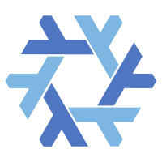

<div align="left">

<div>
<a href="https://nixos.org"></a>

<a href="https://opensource.org/licenses/MIT">

</a>
</div>
<!-- <div> -->
<!-- [](https://github.com/YOUR_GH_NAME/YOUR_REPO/actions) -->
<!-- </div> -->
</div>

# Axiom
One flake to build them all: **macOS** (nix-darwin) + **NixOS** + **home-manager**. Clone and switch it, then go touching grass.

---

## 📖 TOC
- [Features](#features)
- [Folder Map](#folder-map)
- [Quick Start](#quick-start)
  - [macOS (nix-darwin)](#macos-nix-darwin)
  - [NixOS](#nixos)
- [Updating](#updating)
- [Tips](#tips)
- [Contributing](#contributing)
---

## ✨ Features
- **Zero bootstrap scripts** – pure `nix` commands only
- **Multi-host, multi-user** – keep all machines in one repo
- **Deterministic** – lock file pins every bit
- **Modular** – mix & match common modules (`desktop`, `dev`, `docker`, `gaming`…)
- **CI cached** – GitHub Actions builds your system closure nightly → cachix push

---

## 📁 Folder Map

## 🚀 Quick Start

###   MacOS (nix-darwin)

```zsh
# Clone the repo
git clone git@github.com:BeauvnTu/Axiom.git
# enter the repo
cd Axiom

# Apple  Chip

# apply the userinfo 
sh ./aarch64-darwin/apply 

# build the system
sh ./aarch64-darwin/build

# or build and switch
sh ./aarch64-darwin/build-switch

# 
```

###   Linux (NixOS)

TBD....
