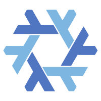

<div align="left">

<div>
<a href="https://nixos.org"></a>

<a href="https://opensource.org/licenses/MIT">

</a>
<a href="https://beauvntu.github.io/Axiom">

</a>
</div>
<!-- <div> -->
<!-- [](https://github.com/YOUR_GH_NAME/YOUR_REPO/actions) -->
<!-- </div> -->
</div>

# Axiom
One Flake to Rule Them All – for macOS (nix-darwin), NixOS, and home-manager.

Clone this repo, run a command, and watch your system bend to your will. No more configuration chaos. More time for important things—like sipping coffee while your OS sets itself up.

✨ git clone your way to sanity.
⚡ nix run your way to glory.

⚠️ Warning: Side effects may include unexpected happiness, extra free time, and the strange urge to show off your terminal to friends.

---

## 📖 TOC
- [📚 在线文档](https://beauvntu.github.io/Axiom)
- [✨ Features](#-features)
- [📁 Folder Map](#-folder-map)
- [🚀 Quick Start](#-quick-start)
  - [Linux (NixOS)](#nixos)
  - [MacOS (nix-darwin)](#nix-darwin)
- [🧪 DevShells](#-devshells)
- [🤖 FAQ](#-faq)

## ✨ Features
- **Zero bootstrap scripts** – pure `nix` commands only
- **Multi-host, multi-user** – keep all machines in one repo
- **Deterministic** – lock file pins every bit
- **Modular** – mix & match common modules (`desktop`, `dev`, `docker`, `gaming`…)
- **CI cached** – GitHub Actions builds your system closure nightly → cachix push

---

## 📁 Folder Map

```
├── apps
│   └── software.md
├── assets
│   ├── linux.svg
│   ├── macos.svg
│   └── nix-icon.svg
├── devshells
│   ├── default.nix
│   ├── deno
│   ├── go
│   ├── java
│   ├── node
│   └── rust
├── flake.lock
├── flake.nix
├── hosts
│   ├── darwin
│   └── nixos
├── modules
│   ├── darwin
│   ├── nixos
│   └── shared
├── overlays
│   └── README.md
├── README.md
└── scripts
    ├── aarch64-darwin
    ├── aarch64-linux -> x86_64-linux
    ├── x86_64-darwin
    └── x86_64-linux
```
## 🚀 Quick Start
First of all, you should run the command to install the nix
```sh
sh <(curl -L https://nixos.org/nix/install) --daemon
```
Axiom is a declarative system configuration management tool built on Nix, supporting both macOS (nix-darwin) and Linux (NixOS). It enables rapid deployment of complete development environments through simple commands, encompassing system configuration, development tools, and desktop environments.

### NixOS
Seamless Linux Environment Setup

> ⚠️ Linux (NixOS) support is currently under development. Stay tuned for future updates.

### nix-darwin
MacOS Setup Guide

```zsh
# Clone the repo
git clone git@github.com:BeauvnTu/Axiom.git

# enter the folder
cd Axiom/scripts

# Apple  Chip
# apply the your info 
sh ./aarch64-darwin/apply 

# build the system
sh ./aarch64-darwin/build

# or build and switch
sh ./aarch64-darwin/build-switch
```

## 🧪 DevShells

Provide reproducible, stack-specific dev environments without global installs. Enter with nix develop to get the exact toolchains and PATH you need (preferring project-local node_modules/.bin) for Node, Rust, Go, Java, Deno, and more.

The environment entered by runing nix develop xxx use bash as default shell-env.You can use `nix develop -c zsh xxx` to enter the zsh-env.

```zsh
# Default devShell: minimal dependencies (zsh, git), no language toolchains.
nix develop -c zsh

# Node devShell: Node.js (20/22) with Corepack (pnpm, Yarn) enabled; prefers project-local node_modules/.bin.
nix develop .#node22 -c zsh

# Rust devShell: Rust toolchain (rustup, cargo, clippy, rustfmt, rust-analyzer); reproducible, no global installs.
nix develop .#rust -c zsh

# Go devShell: Go toolchain (go, gopls, delve, go-tools, gotestsum); reproducible, no global installs.
nix develop .#go -c zsh

# Java devShell: JDK (8/11/17), Maven, Gradle; reproducible, no global installs.
nix develop .#java17 -c zsh 
```

You can also explicitly specify the system for different architectures: 

```zsh
nix develop .#frontend --system aarch64-darwin -c zsh
nix develop .#rust --system x86_64-linux' -c zsh
```

It’s recommended to place a .envrc (with direnv) or a devenv.yaml in the project subdirectory so the corresponding devShell is auto-activated when entering the directory.


## 🤖 FAQ

- **⚠️ After running build and switch, `~/.zshrc` and `~/.oh-my-zsh` package are still missing**  
  
  1. In your Home-Manager config, quote the plugin name exactly like this: programs.zsh.oh-my-zsh = "oh-my-zsh"; (double quotes around the string).
  2. Make sure ~/.zshrc.backup does not exist; with home-manager.backupFileExtension = "backup" Home-Manager will refuse to proceed if it sees that file.
  3. Home-Manager installs Oh-My-Zsh into the Nix store and only references it from ~/.zshrc, so you won't find an oh-my-zsh folder in your home directory.
